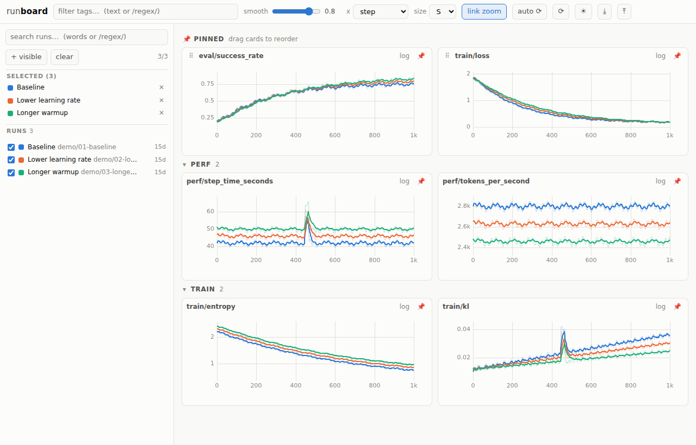
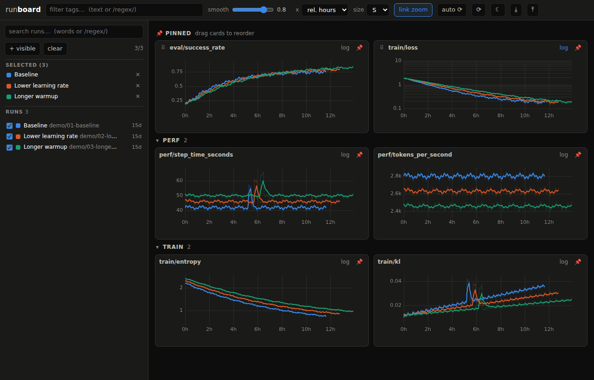

# runboard

A fast, opinionated viewer for TensorBoard event files. Training keeps writing
normal `events.out.tfevents.*` files; runboard reads the same files but serves
a UI built for experiment comparison instead of TensorBoard's.

Built 2026-08-27 for day-to-day comparison of training runs on a shared cluster.

## Why runboard instead of TensorBoard?

The main reasons to choose runboard are its run-selection workflow, persistent
chart layout, readable run names, and predictable colors. The table describes
the implemented behavior and its practical benefit; it is not a claim that
TensorBoard lacks every listed capability or a comparative speed benchmark.

| Feature | What it makes easier |
| --- | --- |
| **Search and select runs in one sidebar** | Search by words or `/regex/`, toggle individual checkboxes, select all visible matches, or clear the selection. Selected runs stay at the top as a global legend. |
| **Search resume aliases without duplicate runs** | Search also matches symlink aliases, such as another job ID for the same log directory. Discovery deduplicates by real path and saved selections can migrate to the canonical run ID. |
| **Pin and reorder charts** | Pin any metric to the top, then drag pinned cards into the comparison order you want. Pins and order survive reloads. |
| **Rename runs for the comparison** | Give a long run ID a short display name with the ✎ button. The original ID remains visible; event files and directory names are untouched. |
| **Stable colors and line patterns** | Colors are assigned in selection order and stay fixed while a run remains selected. Removing another run does not recolor the rest. Eight palette slots work in light and dark themes; additional runs use dash patterns, also shown in legend chips. Selection is capped at 30 runs. |
| **Linked zoom across metrics** | Drag on one chart to zoom every chart to the same x range, or turn linking off. Double-click resets the view. Compare a reward change with a loss or timing spike at the same step. |
| **Full-resolution smoothing** | TB-style debiased EMA is computed on the server before downsampling. Changing the viewport does not change the underlying smoothing calculation; the raw curve remains visible underneath. |
| **Downsampling that preserves extrema** | Per-bucket minima and maxima retain narrow spikes that simple point skipping could miss, while limiting the number of points sent to the browser. |
| **Tooltips that expose logging cadence** | Each run snaps to its own nearest point. If that point differs from the cursor position, the tooltip labels its actual step or time rather than implying the runs logged together. |
| **Incremental live refresh** | A 30-second auto-refresh reads appended event-file bytes after the initial parse. Recent-write indicators help identify active logs; manual refresh is available too. |
| **Explicit resume and file-change handling** | Repeated steps use the last parsed value. Replaced, truncated, or deleted files trigger a full reparse so previously cached points from those files do not linger. |
| **Flexible metric views** | Filter tags with text or regex, collapse tag groups, choose chart sizes, toggle log scale per chart, and switch the x axis between steps, relative hours, and wall clock. |
| **Portable comparison settings** | Selection, aliases, pins, order, scales, and theme persist in browser localStorage. Export/import JSON to carry the same view to another browser. |
| **Use the logs you already write** | Read existing TensorBoard scalar event files directly. No training-code changes, hosted tracking account, or separate ingestion database are required. Runs are parsed lazily, with an LRU point budget for cached data. |

**Scope:** runboard is a scalar comparison viewer. It does not implement
TensorBoard's broader plugin surface, such as image/audio viewers, histograms,
model graphs, or profiling. Browser settings are local to that browser unless
you export them; this is not a shared, server-side dashboard store.

## Screenshots

These are browser screenshots of the running app reading **synthetic TensorBoard
event files**, not real training results. Each view compares three demo runs
across six metrics, using different logging cadences.

**Light theme:** renamed runs, stable comparison colors, pinned success/loss
charts, and smoothed curves with raw values underneath.



**Dark theme:** the same comparison in relative hours, with a logarithmic loss
axis. Run colors and the pinned layout remain consistent across the views.




## Run it

```bash
~/GitHub/runboard/run.sh            # 127.0.0.1:8898
```

From your laptop:

```bash
ssh -L 8898:localhost:8898 <login-node>
# then open http://localhost:8898
```

Flags: `--logdir` (default `/data/shared/tensorboard`), `--port` (8898),
`--host` (127.0.0.1 — keep it loopback on the shared login node; there is no
auth), `--scan-interval` (120 s), `--max-depth` (8).

Dependencies (all already in the `training` conda env): fastapi, uvicorn,
numpy, tensorboard (only for the `Event` protobuf).

## How it works

- **Discovery**: a background thread walks `--logdir` (following symlinks,
  deduping by realpath — the shared root is mostly symlinks) for directories
  containing `*.tfevents.*` files.
- **Parsing**: event files are read as raw tfrecord framing + the `Event`
  proto — no `EventAccumulator`, no reservoir sampling. After the initial read,
  only appended bytes are parsed (offset tracked per file). Runs are
  parsed lazily on first selection and LRU-evicted above ~30 M points.
- **Resume semantics**: duplicate steps (crash → resume from an earlier
  checkpoint) resolve last-write-wins after a stable sort by step. A replaced,
  truncated, or deleted event file triggers a full reparse of that run so no
  stale points linger.
- **Tooltips are honest about cadence**: each series snaps to its own nearest
  point, and when that point's x differs from the cursor the row shows
  `@ step N` — runs logged at different cadences are never mislabeled.
- **Downsampling**: per-bucket min+max (~1 200 points per series), so spikes
  are never smoothed away by decimation.
- **Client state** (selection, aliases, pins, order, log toggles, theme) lives
  in `localStorage` under `runboard:v1`; the ⤓/⤒ topbar buttons export/import
  it as JSON to move between browsers.

## Tests

```bash
tests/run_all.sh        # backend + headless-Chromium UI suite, hermetic
```

Both suites build their own synthetic event-file corpus in a tempdir
(`tests/synthdata.py`) — no dependency on the shared logs. `test_backend.py`
covers parsing (incremental tail, resume last-wins, replace/truncate reparse,
stat throttle vs force), full-resolution EMA, spike-preserving downsampling,
and scanner alias handling. `test_ui.py` starts its own server on a free port
and drives selection, multi-run charts, rename, pin + drag-reorder, linked
zoom, log scale, persistence, chart-map GC, the pin/card cap, cadence-honest
tooltips, the stale-smoothing-response race (via a delayed intercepted
response), the persisted-selection cap, alias-id migration, and legend chip
patterns. Run them in the `training` conda env after any change.

## Palette provenance

The categorical colors and light/dark chrome are the reference dataviz palette
(8 slots, both modes), used verbatim in its documented slot order — that order
is validated for adjacent-pair color-blind separation (worst CVD ΔE 9.1 light /
8.4 dark) and normal-vision separation (19.6 / 19.3). Don't reorder the slots
casually; the ordering is the safety mechanism.
